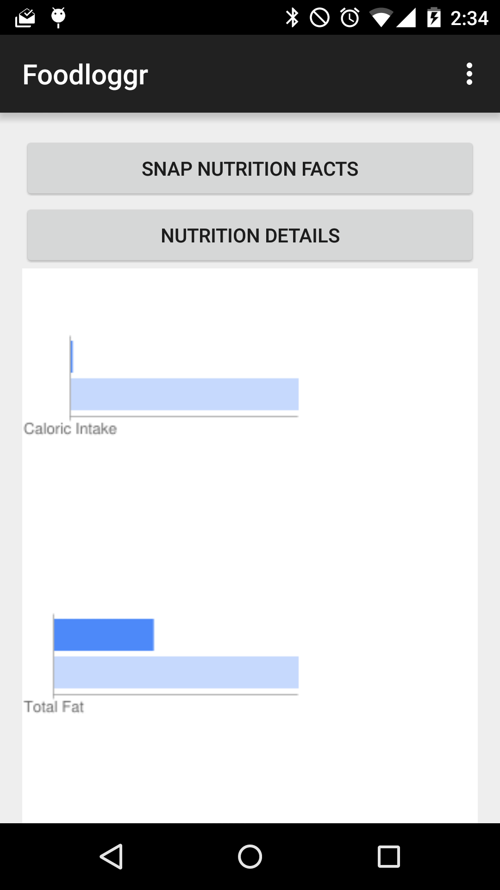
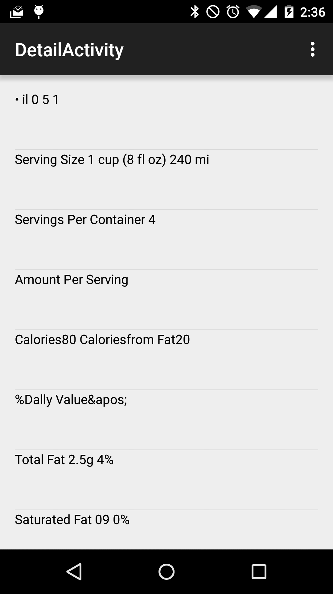
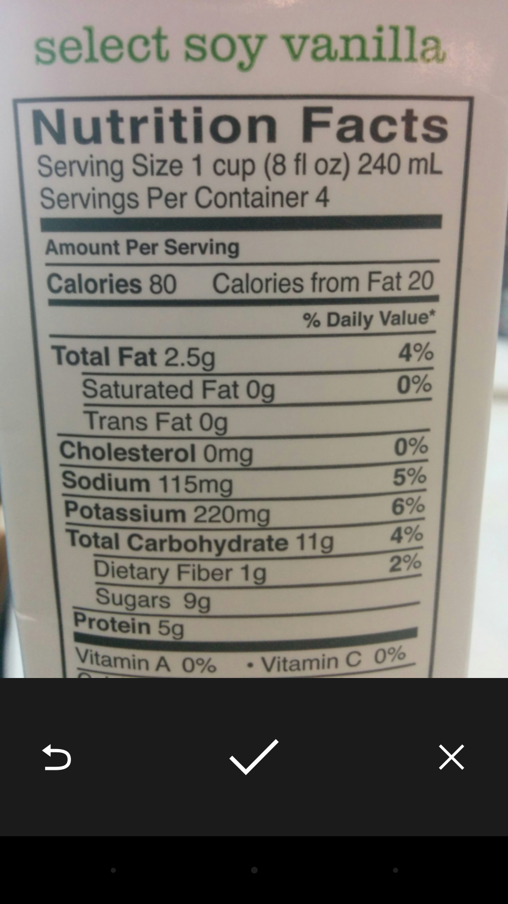
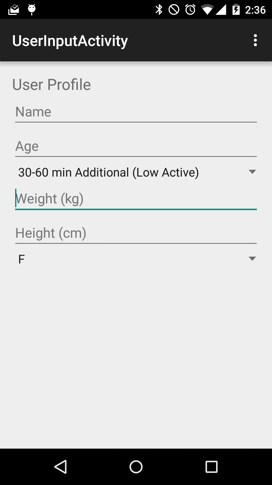

# Foodloggr - Android app

Don't understand nutrition labels? Let your mobile device do it for you.

This uses HP's Idol On Demand OCR API.

## Screenshots

### Main screen

### OCR Details

### Label capture

### User profile

